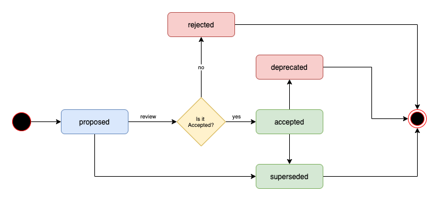

# ADR
[Reference](https://asiermarques.medium.com/implementing-a-workflow-for-your-architecture-decisions-records-ab5b55ee2a9d)

ADRs are a great tool to register the context of every decision and other evaluated alternatives to them. This is crucial information for new people who will need to evolve the architecture in the future.

Life cycle explained in the picture:




Example: 
```
# 1. Record architecture decisions

Date: 2016-02-12

## Status

Accepted

## Context

We need to record the architectural decisions made on this project.

## Decision

We will use Architecture Decision Records, as described by Michael Nygard in this article: http://thinkrelevance.com/blog/2011/11/15/documenting-architecture-decisions

## Consequences

See Michael Nygard's article, linked above.
```

# Implementation
In order to implment it on our repo we will use [ADR Gen](https://github.com/asiermarques/adrgen), a tool that allows us to write yaml config file. 

# Architectural Decision History
Using the tool mentioned at the previous section, we can keep a history of our records.
